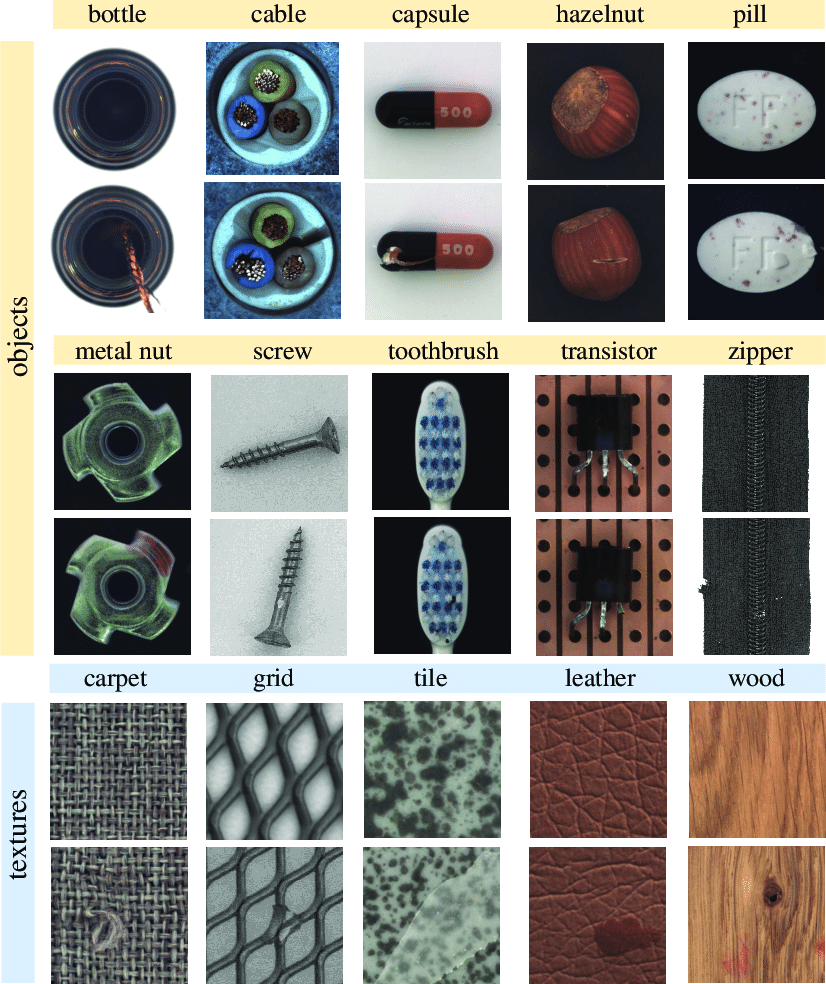
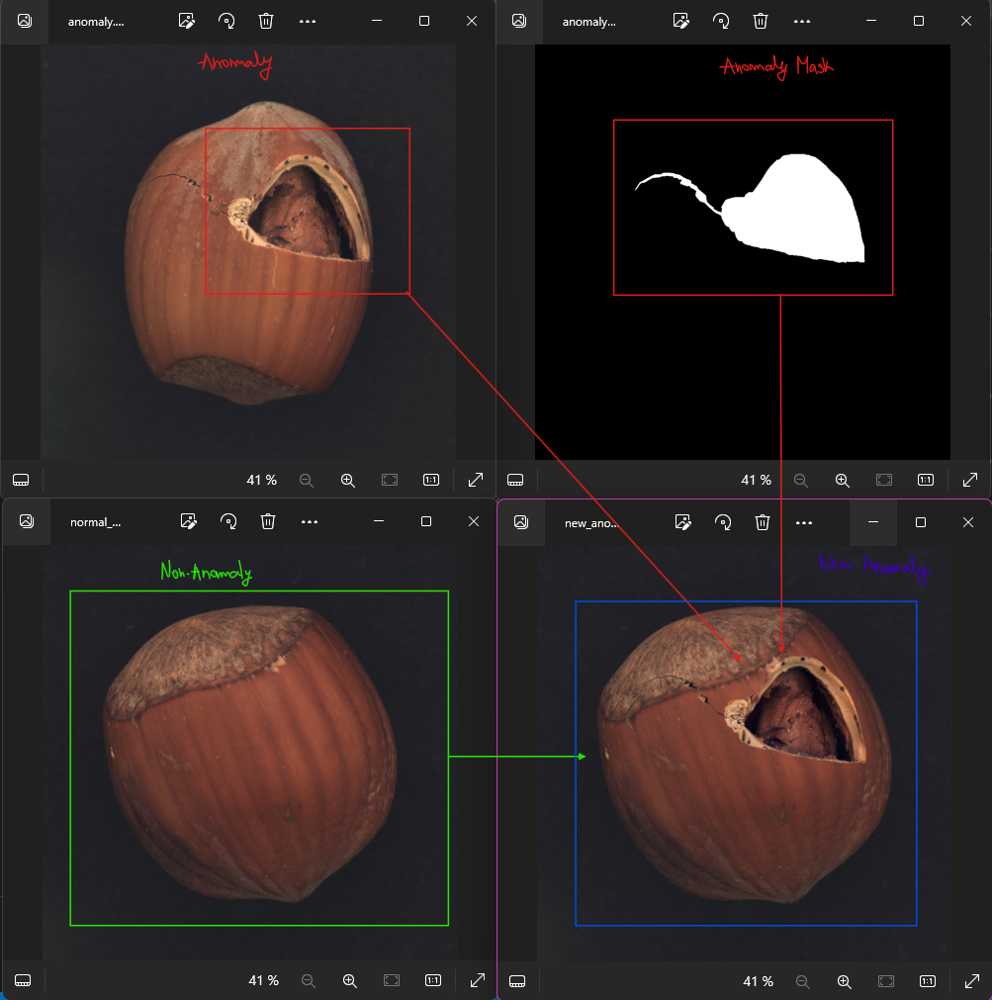
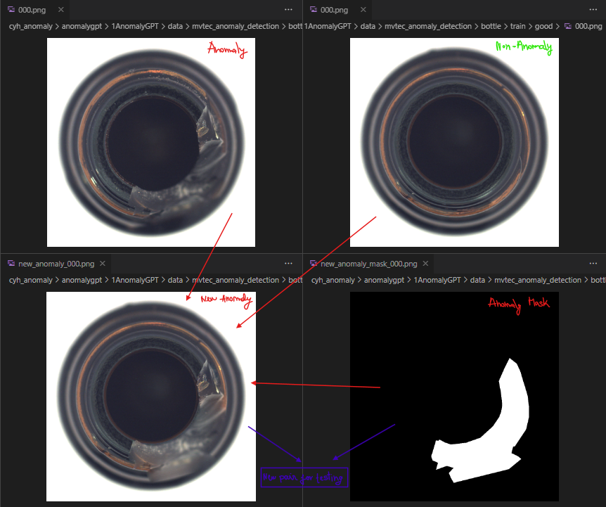
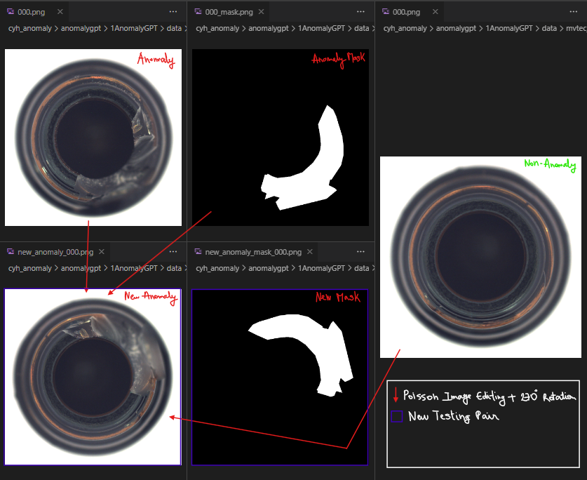
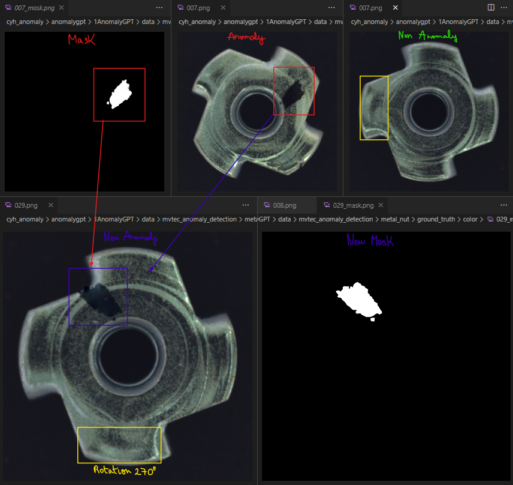

# Poisson Image Editing

This repository contains a Python implementation of the [Poisson Image Editing](https://github.com/Pablo-Molla-Charlez/Poisson_Image_Editing/blob/master/Poisson_Image_Editing_Paper.pdf) paper, which allows for seamless blending of two images. This implementation is provided by user PPPW.

My personal contributions involve applying this method to the field of Industrial Anomaly Detection (IAD). Specifically, I use this technique for data augmentation on the [MVTec Anomaly Dataset](https://www.mvtec.com/company/research/datasets/mvtec-ad) to enhance the model's learning capabilities in [AnomalyGPT](https://github.com/Pablo-Molla-Charlez/AnomalyGPT). The MVTec AD dataset is designed for benchmarking anomaly detection methods, focusing on industrial inspection. It contains over 5000 high-resolution images across 15 different object and texture categories. Each category includes defect-free training images and a test set with various defects and non-defective images.

The MVTec dataset is composed of the following objects:

  

To create more realistic and detailed anomaly images, the following elements are needed:
- The original mask (label) describing the anomaly location. (mask)
- The original anomalous image. (source)
- A non-anomalous image where the anomaly will be integrated. (target)

The Poisson image editing process will then generate `new_anomaly_mask_000.png` (ground_truth image) and `new_anomaly_000.png` (new anomalous image), which will be saved in the directory specified by the `base_dir` variable. In this case, not only was applied the Poisson image editing technique as described in the original paper, but to generate even more different pictures, I considered the composition of the technique and some standard operations such as rotations, horizontal and vertical flips, changes in brightness, translations and it could also be applied some blurring effects on the resulting image.

Let's see some examples. The first example only considers the direct application of the technique, with no further composition of operations.

  

In this second case, we can observe the before/after applying the composition of one operation, a rotation of 270º. Bear in mind that, in my case I had to use for the model training (AnomalyGPT) the couple mask + anomaly picture, therefore both images had to follow the same operations.

  

  

In this last example, it is as well applied the technique and the rotation of 270º degrees.

  

## Repository Structure

A brief description of each file's functionality:

* `poisson_image_editing.py`: Takes the source, target, and mask images along with the mask offset, and runs the Poisson image editing algorithm for seamless image blending.

* `poisson_image_editing.ipynb`: A notebook demonstrating the process.

### Some recommendations

* The code was implemented in order to apply in one execution the technique to all the classes at the same time, generating the corresponding couples of samples (mask + anomalous images). The functions `poisson_edit` and `laplacian_matrix` were not modified from the original script from PPPW, however the `main`function was.
* The parameter `offset` determines where the anomaly will be pasted, therefore, check multiple different configurations to make sure that the new anomalous image includes the anomaly, otherwise it will be coy/pasted on the background of the target image.
* It would be wonderful to determine an autoposition model that is able to localize the object position to make sure that the anomaly pasted using the Poisson technique is always within the object. Sometimes, due to the way the images are taken, the pasted anomalies are found to be outside leading to not useful samples.
* Further details and scripts can be found on the original [repository](https://github.com/PPPW/poisson-image-editing).

