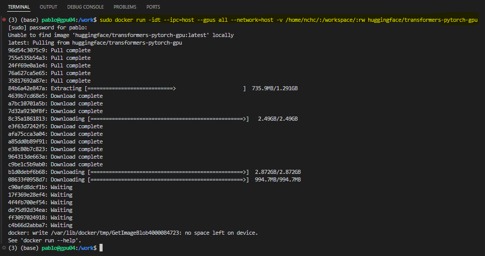

# Multi-node Training Setup

In order to train the model AnomalyGPT more efficiently and faster, we implemented the following configuration to correctly setup the multi-node environment. We utilize two nodes based on A100 Nvidia GPUs to train the model.

## Step 1: Docker environment
Run the code in a docker environment.

```
sudo docker run -idt --ipc=host --gpus all --network=host -v /home/nchc/:/workspace/:rw --name my-container huggingface/transformers-pytorch-gpu
```

Explanation:

1. `sudo`: Runs the command with superuser (administrator) privileges. This is often necessary for Docker commands that require system-level changes or access to certain resources.
2. `docker run`: This is the Docker command to create and start a new container from a specified Docker image.
3. `-i (interactive)`: Keeps the container running so you can interact with it. This is useful when you need to keep the standard input open.
4. `-d (detached)`: Runs the container in the background and prints the container ID. This means the container will run as a daemon process.
5. `-t (tty)`: Allocates a pseudo-TTY (teletypewriter), which allows you to interact with the container through the terminal.
6. `--ipc=host`: Shares the host’s IPC (Inter-Process Communication) namespace with the container. This can improve the performance of certain operations that rely on shared memory, but it can also pose security risks.
7. `--gpus all`: Makes all the GPUs on the host machine available to the container. This is necessary for running GPU-accelerated applications inside the container.
8. `--network=host`: Uses the host's network stack inside the container. This means the container shares the network configuration of the host machine, allowing for improved network performance and easier networking configuration.
9. `-v /home/nchc/:/workspace/:rw`: Mounts a volume from the host machine to the container.
      - `/home/nchc/`: The directory on the host machine.
      - `/workspace/`: The directory inside the container where the host directory will be mounted.
      - `:rw`: Mounts the directory with read-write permissions, allowing both the host and container to read and write to this directory.
10. `--name my-container`: Names the container as "my-container".
11. `huggingface/transformers-pytorch-gpu`: The Docker image to use for creating the container. This specific image is from Hugging Face, configured with PyTorch and GPU support for running transformer models.

<p align="center">
  
</p>

Make sure to not create the new container while using the GPUs, otherwise the container won't be able to be correctly created and used, especially due to the argument `--gpus all`.

Use/open the container's shell.
```
docker exec -it containername bash
```

* Installation of the required library
```
apt-get update
cd anomalygpt
pip install -r requirements.txt
```

## Step 2: Set up passwordless SSH login on all nodes

Ensure Passwordless SSH Login
* Installation of the required tools, make sure for each node(master and worker)
```
apt-get update
apt install openssh-server
```
```
apt-get install net-tools
```
```
## setting root passwd
passwd root
```

* Generate an SSH key pair (if not already done):
```
cd
mkdir .ssh
ssh-keygen
```

* Add the public key to the `authorized_keys` file:
Master node setup public key for localhost passwordless
```
cat ~/.ssh/id_rsa.pub >> ~/.ssh/authorized_keys
```

* Ensure the permissions of the .ssh directory and authorized_keys file are correct:

```
chmod 700 ~/.ssh
chmod 600 ~/.ssh/authorized_keys
```

```
sed -i 's/#PermitRootLogin prohibit-password/PermitRootLogin yes/' /etc/ssh/sshd_config
```

If you want to change the port of ssh, you can do it in the following way
```
sed -i 's/#Port 22/Port 2222/' /etc/ssh/sshd_config
service ssh restart && netstat -tulpn
```

2. Worker Node Setting Public Key.
Put the public key to the host you want to log in.

```
cd .ssh
scp -P 2222 node21.pub root@10.250.64.30:.ssh
```

The default file for handling public keys is
authorized_keys, so the public keys just sent must be accumulated into this file:
```
ssh -p 2222 root@10.250.64.30
```


```
cat .ssh/node21.pub >> .ssh/authorized_keys
```

Ensure the permissions of the .ssh directory and authorized_keys file are correct:

```
chmod 700 .ssh/ 
chmod 644 .ssh/authorized_keys 
```

check the authority

```
ll -d .ssh
ll .ssh/authorized_keys 
```

Finish and leave.
```
exit
```

## Step 3: Create config file with direct ssh name

```
cd .ssh
apt install nano
nano config
```

config file:

```
Host my-30
    HostName 10.250.64.30
    User root
    IdentityFile ~/.ssh/a30ip31
    Port 2222

Host my-21
    HostName 10.250.64.21
    User root
    IdentityFile ~/.ssh/a30ip31
    Port 2222

Host localhost
    HostName 10.250.64.31
    User root
    IdentityFile ~/.ssh/a30ip31
    Port 2222
```

* Restart the SSH service:

```
service restart ssh
```

* Verify passwordless SSH login:
```
ssh localhost
ssh my-21
ssh my-30
```

## Setp 5: Set Up the Hostfile for deepspeed
Create a hostfile that lists all participating nodes and their GPU counts. Assuming host and worker are the hostnames or IP addresses of your master and worker nodes:

However, it is important to make sure that each worker node has the same code and directory as the master node.

The hostfile can be placed in any directory.
hostfile:
```
localhost slots=2
my-30 slots=2
```

## Setp 6: Confirm Environment Variables are Loaded
This step can be skipped if there is no problem.

* Set the correct environment variables in your `.bashrc` or `.bash_profile` file:
    
```bash
nano ~/.bashrc
```
Add the required environment variables, for example:
    
```plaintext
export PATH=/path/to/your/python/bin:$PATH
export PYTHONPATH=/path/to/your/python/lib/python3.x/site-packages:$PYTHONPATH
```

* Manually load the environment variables:
    
```bash
source ~/.bashrc
```

* Check Firewall Settings

Ensure that the firewall on all nodes does not block the ports used by DeepSpeed. You can temporarily disable the firewall to rule out this issue:
    
```bash
sudo service ufw status
sudo ufw disable
```


## Setp 7: Start DeepSpeed Multi-Node Training
Run the DeepSpeed command on the master node (host), specifying the location of the hostfile and other relevant parameters:

```
deepspeed --hostfile=./hostfile --master_port=28400 train_mvtec.py \
    --model openllama_peft \
    --stage 1 \
    --imagebind_ckpt_path ../pretrained_ckpt/imagebind_ckpt/imagebind_huge.pth \
    --vicuna_ckpt_path ../pretrained_ckpt/vicuna_ckpt/7b_v0/ \
    --delta_ckpt_path ../pretrained_ckpt/pandagpt_ckpt/7b/pytorch_model.pt \
    --max_tgt_len 1024 \
    --data_path  ../data/pandagpt4_visual_instruction_data.json \
    --image_root_path ../data/images/ \
    --save_path  ./ckpt/train_mvtec/ \
    --log_path ./ckpt/train_mvtec/log_rest/
```
