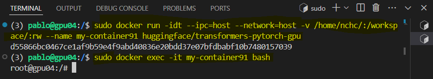
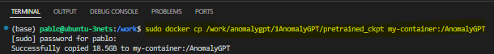
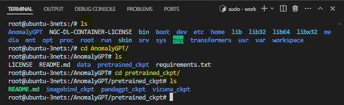
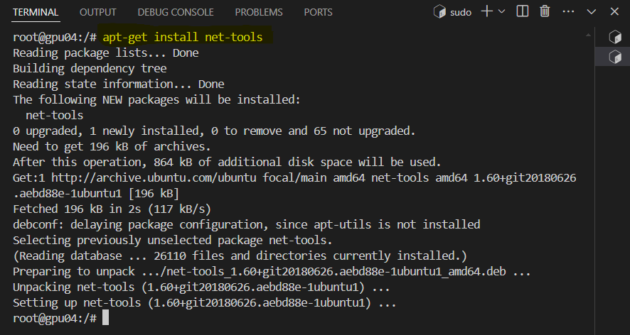
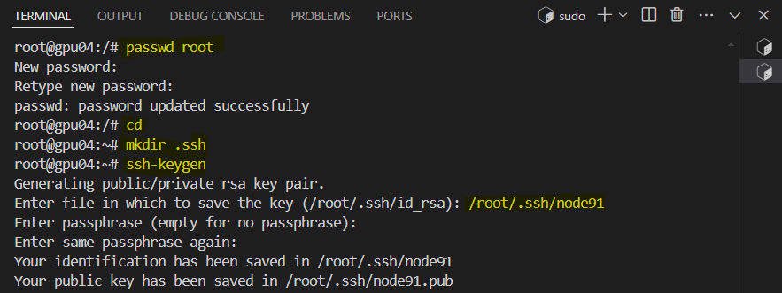
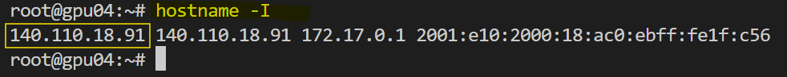

# Multi-node Training Setup

In order to train the model AnomalyGPT more efficiently and faster, we implemented the following configuration to correctly setup the multi-node environment. We utilize two nodes based on A100 Nvidia GPUs to train the model. Bear in mind that the docker environment with all its configurations as well as information (model, data, checkpoints) needs to be set up equally for each node, therefore in our case, we need to `repeat the process twice`.

The IP nodes which will be used are: 140.110.18.89 and 140.110.18.91
The following commands are performed originally in the node 89.


## Step 1: Docker environment
Run the code in a docker environment. As we will be training in two nodes, each node must have its own container, created under the same arguments.

```
sudo docker run -idt --ipc=host --gpus all --network=host -v /home/nchc/:/workspace/:rw --name my-container huggingface/transformers-pytorch-gpu
```

Explanation:

1. `sudo`: Runs the command with superuser (administrator) privileges. This is often necessary for Docker commands that require system-level changes or access to certain resources.
2. `docker run`: This is the Docker command to create and start a new container from a specified Docker image.
3. `-i (interactive)`: Keeps the container running so you can interact with it. This is useful when you need to keep the standard input open.
4. `-d (detached)`: Runs the container in the background and prints the container ID. This means the container will run as a daemon process.
5. `-t (tty)`: Allocates a pseudo-TTY (teletypewriter), which allows you to interact with the container through the terminal.
6. `--ipc=host`: Shares the host’s IPC (Inter-Process Communication) namespace with the container. This can improve the performance of certain operations that rely on shared memory, but it can also pose security risks.
7. `--gpus all`: Makes all the GPUs on the host machine available to the container. This is necessary for running GPU-accelerated applications inside the container.
8. `--network=host`: Uses the host's network stack inside the container. This means the container shares the network configuration of the host machine, allowing for improved network performance and easier networking configuration.
9. `-v /home/nchc/:/workspace/:rw`: Mounts a volume from the host machine to the container.
      - `/home/nchc/`: The directory on the host machine.
      - `/workspace/`: The directory inside the container where the host directory will be mounted. This directory must be the same in both containers.
      - `:rw`: Mounts the directory with read-write permissions, allowing both the host and container to read and write to this directory.
10. `--name my-container`: Names the container as "my-container".
11. `huggingface/transformers-pytorch-gpu`: The Docker image to use for creating the container. This specific image is from Hugging Face, configured with PyTorch and GPU support for running transformer models.

<p align="center">
  
  
</p>

Make sure to not create the new container while using the GPUs, otherwise the container won't be able to be correctly created and used, especially due to the argument `--gpus all`. That's why while creating the container in node 91, in the command execution, it wasn't included the argument `--gpus all`, but it must be present if the intention is to use multi-node training.

* Open the container's shell.
```
docker exec -it my-container bash
```

* Cloning the AnomalyGPT repository
```
apt-get update
git clone https://github.com/CASIA-IVA-Lab/AnomalyGPT.git
cd Anomalygpt
```

<p align="center">
  
</p>

In node 91, the exact process needs to be followed inside its container, because when using multi-node, both nodes need to share the exact same code, data, configurations as well as libraries.

* Installing the required libraries
```
pip install -r requirements.txt
```
<p align="center">
  
</p>

* Deleting original folders: code, pretrained_ckpt and images
<p align="center">
  
</p>

### Transfering code, pretrained_ckpt and data images

* Copying downloaded model checkpoints to container
<p align="center">
  
</p>

* Checking copy of `/pretrained_ckpt`
<p align="center">
  
</p>

* Copying data to container
<p align="center">
  
</p>

* Copying code to container
<p align="center">
  
</p>

### Warning: If the message "No space left" is shown while trying to install or copy data into the container, you can proceed as follows, if not, skip directly to Step 2.

<p align="center">
  
</p>

1. Stop the Docker Service
First, stop the Docker service:

```
sudo systemctl stop docker
```

2. Create a New Docker Directory
Create a new directory to store Docker data. For example, to store data in /work/docker:
```
sudo mkdir -p /mnt/new-disk/docker
```

<p align="center">
  
</p>

3. Modify Docker Configuration File
Edit Docker's configuration file /etc/docker/daemon.json (create it if it doesn't exist):

```
sudo nano /etc/docker/daemon.json
```
Add or modify the following content to set `data-root` to new path: {"data-root": "/mnt/new-disk/docker"}

<p align="center">
  
</p>

4. Migrate Existing Docker Data
Migrate existing Docker data from the old path (typically /var/lib/docker) to the new path:
```
sudo rsync -aP /var/lib/docker/ /mnt/new-disk/docker/
```
It usually takes a while.

5. Restart the Docker Service
```
sudo systemctl start docker
```

6. Verify Configuration Modifications
```
docker info | grep "Docker Root Dir"
```
The output should be the new path, such as /work/docker.

7. Clean Up Old Data (Optional)
If you confirm Docker is functioning correctly and all data has been successfully migrated, you can remove the old data directory to free up space:

```
sudo rm -rf /var/lib/docker
```

## Step 2: Set up passwordless SSH login on all nodes


Ensure Passwordless SSH Login
* Installation of the required tools, make sure that each node (master (Node 89) and worker (Node 91) has installed the following tools inside the container.
```
apt-get update
apt install openssh-server
```

<p align="center">
  
</p>

Follow the same process within node's 91 container:

<p align="center">
  
</p>

Once again, both containers need to have openssh-server and net-tools. 

```
apt-get install net-tools
```
<p align="center">
  
</p>

* Install as well pdsh in both containers and update the apt:
```
apt-get install pdsh
apt-get update
```

* Setting root password: To make it easier, select the same password for both containers.
```
passwd root
```
In container within node 89:
<p align="center">
  
</p>

* Generate an SSH key pair (if not already done):
```
cd
mkdir .ssh
ssh-keygen
```

The file in which I chose to save the key is: /root/.ssh/node89
The file /root/.ssh/node91 repectively for container in node 91.

In container within node 91:
<p align="center">
  
</p>

* Add the public key to the `authorized_keys` file:
Master node setup public key for localhost passwordless
```
cat ~/.ssh/node89.pub >> ~/.ssh/authorized_keys
```
To check that it is included use cat:
<p align="center">
  
</p>

* Ensure the permissions of the .ssh directory and authorized_keys file are correct in both containers:

```
chmod 700 ~/.ssh
chmod 600 ~/.ssh/authorized_keys
sed -i 's/#PermitRootLogin prohibit-password/PermitRootLogin yes/' /etc/ssh/sshd_config
```

<p align="center">
  
</p>

If you want to change the port of ssh, you can do it in the following way:
```
sed -i 's/#Port 22/Port 2222/' /etc/ssh/sshd_config
service ssh restart && netstat -tulpn
```
<p align="center">
  
</p>

* Worker Node Setting Public Key.

In order to define node 89 as the master, the node 91 must have the public key from the node 89 and to do such thing, put the public key to the host you want to log in. 
In this case, we created the public/private keys for node 89, therefore we want them to be sent to node 91 from the container in node 89.

```
cd .ssh
scp -P 2222 node89.pub root@140.110.18.91:.ssh
```

<p align="center">
  
</p>

The default file for handling public keys is authorized_keys, so the public keys just sent must be stored into this file. 
Basically, to allow the connection between the container from node 91 and node 89, the port number needs to be specified as well as include the node's 89 public key into the authorized keys within the container from node 91.
```
ssh -p 2222 root@140.110.18.91
```
<p align="center">
  
</p>

To check that it's actually connected to node 91:

<p align="center">
  
</p>

Now, inside the container from node 91 we authorize node 89:
```
cat .ssh/node89.pub >> .ssh/authorized_keys
```
<p align="center">
  
</p>

* Ensure the permissions of the .ssh directory and authorized_keys file are correct and check the authority (still within 91's container that we connected via the container in node 89):

```
chmod 700 .ssh/ 
chmod 644 .ssh/authorized_keys 
ll -d .ssh
ll .ssh/authorized_keys 
```

<p align="center">
  
</p>

Make sure that you can read (r) and write (w).

* Finish and leave.
```
exit
```

You should have just exited the ssh connection to node 91, and still remain in node 89's container.

## Step 3: Create config file with direct ssh name
Within the container in node 89, install vim because we need to create a configuration file to store the different hosts. Only the master node has to create this file. No need for the workers.

```
cd .ssh
apt install vim
vim config
```
<p align="center">
  
</p>

The content of config file is:

```
Host my-container91
    HostName 140.110.18.91
    User root
    IdentityFile ~/.ssh/node89
    Port 2222

Host localhost
    HostName 140.110.18.89
    User root
    IdentityFile ~/.ssh/node89
    Port 2222
```

<p align="center">
  
</p>

* Restart the SSH service:

```
service ssh restart
```

<p align="center">
  
</p>

* Verify passwordless SSH login:
```
ssh localhost
ssh my-container91
```
<p align="center">
  
</p>

## Step 5: Set Up the Hostfile for deepspeed
Create a hostfile that lists all participating nodes and their GPU counts. As with `config`, this file needs to be as well in the master node 89, inside the container

The hostfile can be placed in any directory and to include the previously mentioned content (slots describes the number of GPUs) hostfile:
```
localhost slots=1
my-container91 slots=1
```
<p align="center">
  
</p>

This is the end of the tutorial.

## Step 6 (Optional): Confirm Environment Variables are Loaded
This step can be skipped if there is no problem.

* Set the correct environment variables in your `.bashrc` or `.bash_profile` file:
    
```
nano ~/.bashrc
```
Add the required environment variables, for example:
    
```plaintext
export PATH=/path/to/your/python/bin:$PATH
export PYTHONPATH=/path/to/your/python/lib/python3.x/site-packages:$PYTHONPATH
```

* Manually load the environment variables:
    
```bash
source ~/.bashrc
```

* Check Firewall Settings

Ensure that the firewall on all nodes does not block the ports used by DeepSpeed. You can temporarily disable the firewall to rule out this issue:
    
```bash
sudo service ufw status
sudo ufw disable
```


## Step 7: Start DeepSpeed Multi-Node Training
Run the DeepSpeed command on the master node (host), specifying the location of the hostfile and other relevant parameters:

```
deepspeed --hostfile=./hostfile --master_port=28400 train_mvtec.py \
    --model openllama_peft \
    --stage 1 \
    --imagebind_ckpt_path ../pretrained_ckpt/imagebind_ckpt/imagebind_huge.pth \
    --vicuna_ckpt_path ../pretrained_ckpt/vicuna_ckpt/7b_v0/ \
    --delta_ckpt_path ../pretrained_ckpt/pandagpt_ckpt/7b/pytorch_model.pt \
    --max_tgt_len 1024 \
    --data_path  ../data/pandagpt4_visual_instruction_data.json \
    --image_root_path ../data/images/ \
    --save_path  ./ckpt/train_mvtec/ \
    --log_path ./ckpt/train_mvtec/log_rest/
```
